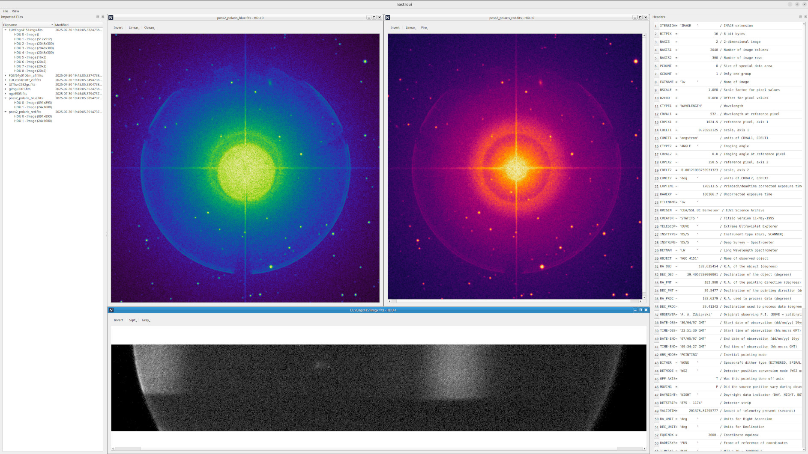

# nastro

<!-- Version and License Badges -->
 
 
 

NAstro is a cross-platform, C++23, FITS 4.0 Viewer.

*The project is currently under heavy development and far from complete.*

## Screenshots

## Current Features

- Import FITS files/directories
- Render FITS images into an MDI work area
- Image Render - Transfer Functions: Linear, Log, Sqrt, Square
- Image Render - Color Mapping: CET perceptually uniform color maps (https://colorcet.com)
- Display FITS headers

## Upcoming Features

- More/better image manipulation controls
- Experimenting with stacking/combining images
- Support viewing other FITS data types (ascii/binary tables)
- WCS parsing
- Per-pixel Color/Physical Value/WCS display
