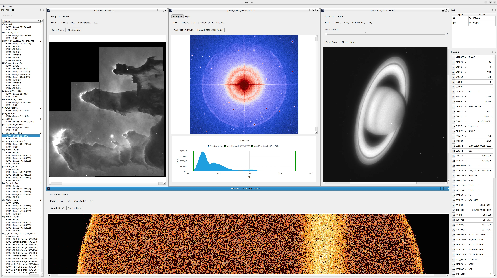

# nastro

<!-- Version and License Badges -->
 
 
 

nastro is a cross-platform, C++23, FITS 4.0 Viewer.

Import FITS files and render N-dimensional image data in an MDI work area.

Image rendering supports common transfer functions and perceptually uniform color mappings.

*The project is currently under heavy development and far from complete.*

## (WIP) Screenshot



## Upcoming Work

- More/improved image manipulation controls
- Exporting of rendered images
- WCS parsing
- Per-pixel Color/Physical Value/WCS display
- A bility to stack/combine images
- Support for viewing other data types (ascii/binary tables)

## Running

Release archives will be provided when the project is closer to completion. 

Until then, build from source using the instructions below.

## Building From Source

The project's dependencies are:
- Qt6 - Core, Gui, Widgets
- Google Test (If building tests)

Either supply these dependencies yourself or use the `prepare_dependencies.py` script in `external` which will use vcpkg to supply these dependencies for you.

The project is defined by a typical CMake project. CMake presets are available following the pattern: 

`desktop-[debug/release/distro]-[windows/linux]`

Supported CMake options:
- BUILD_SHARED_LIBS - Whether to build the underlying FITS library as a shared library (default: OFF)
- BUILD_TESTING - Whether to build the underyling FITS library unit tests (default: ON)
- NASTRO_OPT_DEV_BUILD - Whether to enable all compiler warnings and treat them as errors (default: ON for debug/release presets, OFF otherwise)
- CMAKE_TOOLCHAIN_FILE - Supply this if using the `prepare_dependencies.py` script 

Example (linux) build commands:

```
git clone https://github.com/neon-software-dev/nastro.git
cd nastro/external && python prepare_dependencies.py
mkdir -p ../build && cd ../build
cmake ../src --preset desktop-distro-linux -DBUILD_TESTING=OFF -DCMAKE_TOOLCHAIN_FILE=../external/vcpkg/scripts/buildsystems/vcpkg.cmake
make
```

If on Windows, you'll likely also need to run Qt's `windeployqt` tool, passing in the location of nastroui.exe as an argument (this tool is in either your system Qt SDK or the vcpkg-built Qt SDK if using the `prepare_dependencies.py` script).
